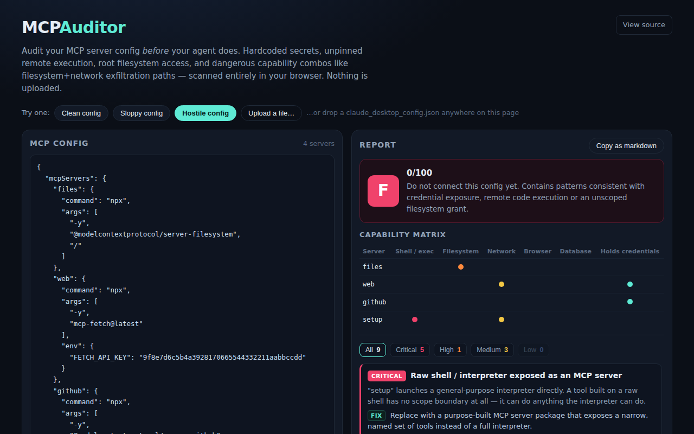

<div align="center">

# MCP Auditor — Audit Your MCP Server Config Before Your Agent Does

**Paste your Claude Desktop / Cursor / VS Code mcpServers config and get an instant security report: hardcoded secrets, unpinned remote execution, root filesystem access, and dangerous capability combos like filesystem+network exfiltration paths. Runs 100% in your browser.**

[](https://github.com/kbipul/mcp-auditor/actions/workflows/ci.yml)
[](https://kbipul.github.io/mcp-auditor/)

`Day 007` of **[kb-daily-builds](https://github.com/kbipul/kb-daily-builds)** — one AI project a day.

</div>

## What it does

An MCP client config (the `mcpServers` block in Claude Desktop, Cursor, Windsurf or VS Code) is a list of programs your agent launches automatically, on every session, with your permissions. GitHub's trending page this week is still stacked with MCP tooling. `ChromeDevTools/chrome-devtools-mcp` picked up 404 stars today alone, and the ecosystem keeps growing faster than anyone's reviewing what these configs actually grant. `curl | bash` installers, unpinned `npx` packages, and filesystem servers scoped to the whole home directory all ship as normal-looking JSON that nobody reads twice.

MCP Auditor is the ten-second first pass. Paste your config and it flags hardcoded secrets and private keys, remote-code-execution patterns (`curl | bash`, encoded PowerShell, URL-fetched scripts), unscoped root filesystem access, and unpinned package execution. The part a line-by-line read easily misses is the last category, dangerous capability combos: if the config enables both a filesystem server and a network/browser server at the same time, that pairing is a built-in exfiltration path even when neither server is individually malicious. It grades the config A–F, shows a per-server capability matrix, and explains every finding with a concrete fix.

Everything runs client-side. The config you paste never leaves the tab, tokens included.


<sub>Screenshot auto-captured by CI on GitHub's runner (the build sandbox can't run a browser) — appears within minutes of publish.</sub>

## Try it

[Live demo →](https://kbipul.github.io/mcp-auditor/) runs fully in your browser. Nothing to install.

```bash
git clone https://github.com/kbipul/mcp-auditor.git
cd mcp-auditor
npm install
npm run dev       # local dev server
npm test          # 34 unit tests, vitest
npm run build     # production build to dist/
```

## How it works

Two layers of rules run over the same config. The `LINE_RULES` array in `src/lib/rules.ts` holds regexes scanned against a pretty-printed, one-token-per-line rendering of the JSON, so every match maps to a real line number: `hardcoded-secret`, `remote-pipe-shell`, `root-path-arg`, `sudo-usage`, `latest-tag`, and the rest of the single-server red flags.

Combo risks never show up that way. Filesystem plus network, a raw shell interpreter sitting alongside anything else, several servers each holding credentials: those span more than one entry, so a second set of rules runs over the parsed server list instead of over the text.

That second layer depends entirely on knowing what each server can reach, and MCP servers don't declare permission scopes the way OS-level sandboxes do. You get a `command` and `args`. So `classify()` in `src/lib/capabilities.ts` tags each entry with some subset of filesystem, network, browser, shell, database and credentials, guessing from package names, the base command, argument strings and env var keys. A `puppeteer` or `playwright` package picks up `network` automatically, since a headless browser can always reach one. This is a heuristic, and the app's own footer says so: a clean report means "nothing obvious found in the launch config", never "safe". It's a fast first pass, not a formal audit.

Scoring reuses the model from [SkillScan](https://github.com/kbipul/skill-scan), its sibling from Day 006. `src/lib/score.ts` deducts 30 points for a critical finding, 15 for high, 7 for medium, 3 for low, and caps each rule's total contribution at twice its own weight so one noisy finding can't zero the score alone. Criticals cap the letter grade at D even if the numeric score is high. Keeping the two tools consistent was deliberate: this is the second day of a small "AI agent supply-chain security" series. Day 006 audited the skills an agent loads, Day 007 audits the servers it talks to.

## Build notes

The genuinely interesting part of this build was realizing MCP configs have no formal permission model to audit against. There is no `allowed-tools` field the way a skill file has one. So "auditing" here means inferring what a server can reach from nothing but its launch command, which is inherently fuzzier than SkillScan's frontmatter-driven checks. I put that in the UI copy rather than overselling precision the tool doesn't have.

Combo detection is the feature I'm most pleased with. It's the one thing a human skimming a config server-by-server is likely to miss, because no single entry looks wrong in isolation. Getting the capability heuristics accurate enough to avoid flooding false positives on ordinary `npx @modelcontextprotocol/server-*` packages took a few iterations of test-writing before the code. The test named `does not flag a clean, scoped, pinned config` caught an early version of the unpinned-package rule that was flagging every single `npx` invocation regardless of whether the package was actually pinned.

## Where the heuristic breaks

`classify()` decides everything by name-matching. The filesystem check is a regex looking for `filesystem`, `file-system`, `fs`, `allowed-director`, `--root` or `directory` somewhere in the server's name, command, args and URL joined into one string. That covers the official `@modelcontextprotocol/server-*` packages, which is most of what people paste in. A well-known server with an unusual internal name could be under-classified: no keyword match means no capability tag, so a server that reads your disk gets scored as though it doesn't.

The combo rules sit downstream of those tags, so an under-classified server also drops out of the filesystem+network check that's the whole reason the tool exists, and it drops out silently. Nothing in the report tells you a server was classified as reaching nothing.

A v2 could ship a small allow-list of known-good official server packages to reduce both false positives and false negatives. I'm not convinced that's the answer. An allow-list needs maintaining, and it does nothing for a server published the week after I write it. I don't have a better idea yet.

## Stack

| | |
|---|---|
| UI | React 18, TypeScript 5 |
| Build | Vite 6 |
| Tests | Vitest 2 (34 unit tests across parser, capability classifier, rule engine, and end-to-end sample grading) |
| Deploy | GitHub Pages via Actions |

---

<div align="center"><sub>
Built by <a href="https://www.kumarbipul.com"><b>Kumar Bipul</b></a> ·
IT Director → AI/ML · <a href="https://github.com/kbipul">github.com/kbipul</a>
</sub></div>
